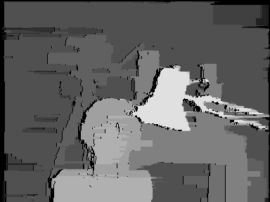

# Stereo Matching Algorithms in MATLAB and Python

Optimized (very fast) stereo matching algorithms in MATLAB and Python. It includes implementations of Block Matching, Dynamic Programming, Semi-Global Matching, Semi-Global Block Matching and Belief Propagation.

## Features

- Multiple stereo matching algorithms

  - **Block Matching (BM)**
  - **Dynamic Programming (DP)**
  - **Semi-Global Matching (SGM)**
  - **Semi-Global Block Matching (SGBM)**
  - **Belief Propagation (BP)**

- Two different versions of Dynamic Programming

- Three different versions of Belief Propagation

- All algorithms are implemented in both MATLAB and Python.

- The algorithms are optimized for performance using matrix operations and other techniques.

## Project Structure

### Core

- **[matlab/](./matlab/)** – Stereo Matching Algorithms in MATLAB  
- **[python/](./python/)** – Stereo Matching Algorithms in Python  
- **[results/](./results/)** – Disparity Maps  

### Inside `matlab/`

- **[BlockMatching.m](./matlab/BlockMatching.m)** – Block Matching  
- **[DynamicProgramming1.m](./matlab/DynamicProgramming1.m)** – Dynamic Programming with Left–Right Axes DSI  
- **[DynamicProgramming2.m](./matlab/DynamicProgramming2.m)** – Dynamic Programming with Left–Disparity Axes DSI  
- **[SemiGlobalMatching.m](./matlab/SemiGlobalMatching.m)** – Semi-Global Matching  
- **[SemiGlobalBlockMatching.m](./matlab/SemiGlobalBlockMatching.m)** – Semi-Global Block Matching  
- **[BeliefPropagation1.m](./matlab/BeliefPropagation1.m)** – Belief Propagation with *Accelerated* Message Update Schedule  
- **[BeliefPropagation2.m](./matlab/BeliefPropagation2.m)** – Belief Propagation with *Synchronous* Message Update Schedule  
- **[BeliefPropagation3.m](./matlab/BeliefPropagation3.m)** – Belief Propagation with *Synchronous* Message Update Schedule (different approach)  

### Inside `python/`

- **[BlockMatching.py](./python/BlockMatching.py)** – Block Matching  
- **[DynamicProgramming1.py](./python/DynamicProgramming1.py)** – Dynamic Programming with Left–Right Axes DSI  
- **[DynamicProgramming2.py](./python/DynamicProgramming2.py)** – Dynamic Programming with Left–Disparity Axes DSI  
- **[SemiGlobalMatching.py](./python/SemiGlobalMatching.py)** – Semi-Global Matching  
- **[SemiGlobalBlockMatching.py](./python/SemiGlobalBlockMatching.py)** – Semi-Global Block Matching  
- **[BeliefPropagation1.py](./python/BeliefPropagation1.py)** – Belief Propagation with *Accelerated* Message Update Schedule  
- **[BeliefPropagation2.py](./python/BeliefPropagation2.py)** – Belief Propagation with *Synchronous* Message Update Schedule  
- **[BeliefPropagation3.py](./python/BeliefPropagation3.py)** – Belief Propagation with *Synchronous* Message Update Schedule (different approach)  

## Installation

Download the project as ZIP file, unzip it, and run the scripts.

### Python Requirements

- NumPy
- Matplotlib
- OpenCV (`opencv-python`)

## Usage

A stereo matching algorithm works with stereo image pairs to produce disparity maps.
This project contains MATLAB and Python scripts, each implementing a stereo matching algorithm. The files `left.png` and `right.png` contain the stereo image pair used as input.
To use a different stereo pair, replace these two images with your own. In this case, you must also adjust the **disparity levels** parameter in the script you are running.
You may optionally modify other parameters as needed. If the input images contain little or no noise, it is recommended not to use the Gaussian filter.

The results between MATLAB and Python implementation are similar.

## Results

Below are the disparity maps produced from the **Tsukuba stereo pair**.

 

### Block Matching

### Dynamic Programming (Left-Right)

### Dynamic Programming (Left-Disparity)

### Semi-Global Matching

### Semi-Global Block Matching

### Belief Propagation (Accelerated)

### Belief Propagation (Synchronous)

The two different approaches to Belief Propagation with Synchronous message update schedule produce same results.

## Useful Links

- Project homepage: -
- Project repository: https://github.com/aposb/stereo-matching-algorithms

## License

This project is licensed under the MIT License. See the [LICENSE](LICENSE) file for details.
